# Hybrid Team — End-to-End System Flow & HITL Checkpoints

## Overview

This document describes the complete end-to-end workflow for managing signals, decisions, and implementation in a hybrid human-AI system. The flow includes **8 critical HITL (Human-In-The-Loop) checkpoints** where human judgment is required to ensure quality and alignment.

## The Flow

```mermaid
---
title: Hybrid Team — End-to-End Flow & HITL Checkpoints
---
flowchart TD
    classDef human fill:#dbeafe,stroke:#3b82f6,color:#1e3a5f,rx:4
    classDef agent fill:#dcfce7,stroke:#16a34a,color:#14532d,rx:4
    classDef hitl fill:#fef9c3,stroke:#ca8a04,color:#713f12,rx:4
    classDef store fill:#f3f4f6,stroke:#9ca3af,color:#374151,rx:4
    classDef terminal fill:#fce7f3,stroke:#db2777,color:#831843,rx:12

    EXT([" External World<br> Signals · Feedback · Ideas "]):::terminal

    EXT --> CAP["👤  Signal filter<br>Decide what is worth keeping"]:::human
    CAP --> INB[("vault/inbox/")]:::store

    INB --> SORT["🤖 + 👤  Weekly inbox sort<br>Agent triages · Human decides<br>━━━━━━━━━━━━━━━━<br>⚑  HITL checkpoint 1"]:::hitl

    SORT -->|Discard| BIN(["🗑 Deleted"]):::terminal
    SORT -->|Context| DAI[("vault/daily/")]:::store
    SORT -->|Needs thinking| STR[("vault/strategy/")]:::store
    SORT -->|Ready to act| MON

    STR --> CRYS["👤  Is the thinking crystallised?<br>Human decides when a strategy<br>note is ready to graduate<br>━━━━━━━━━━━━━━━━<br>⚑  HITL checkpoint 2"]:::hitl
    CRYS -->|Still evolving| STR
    CRYS -->|Yes| VDEC

    VDEC["👤  Write vault/decisions/<br>Personal record of<br>the decision and why"]:::human
    VDEC --> PDEC

    PDEC["👤  Update project/DECISIONS.md<br>Translate vault decision into<br>an agent-readable constraint<br>━━━━━━━━━━━━━━━━<br>⚑  HITL checkpoint 3"]:::hitl
    PDEC --> MON

    MON["🤖  Backlog health monitor<br>Runs: on schedule · after merge · on demand"]:::agent
    MON -->|Count ≥ X — board is healthy| GH
    MON -->|Count < X — board needs refill| SEARCH

    SEARCH["🤖  Search for candidates<br>strategy/ · inbox/ · PRODUCT.md"]:::agent
    SEARCH --> IDRAFT

    IDRAFT["🤖  AI drafts issue brief<br>Classify type · apply template · generate"]:::agent
    IDRAFT --> ICONF

    ICONF["👤  Review & confirm draft<br>Edit · approve · or discard<br>━━━━━━━━━━━━━━━━<br>⚑  HITL checkpoint 4<br>(review is the leverage, not writing)"]:::hitl
    ICONF -->|Discard| STR
    ICONF -->|Edit & approve| BOARD

    BOARD["🤖  Create issue + add to board<br>Type label · priority · milestone"]:::agent
    BOARD --> GH[("GitHub Issue<br>+ Projects v2")]:::store
    BOARD -->|Still below X| SEARCH

    GH --> SESS["🤖  Agent session<br>Reads CLAUDE.md + issue + files<br>Implements · Opens PR"]:::agent
    SESS --> PR[("Pull Request")]:::store

    PR --> REV["🤖 + 👤  PR review<br>Agent runs checks<br>Human reviews output<br>━━━━━━━━━━━━━━━━<br>⚑  HITL checkpoint 5"]:::hitl
    REV -->|Changes requested| SESS
    REV -->|Approved| MRG

    MRG["👤  Merge<br>━━━━━━━━━━━━━━━━<br>⚑  HITL checkpoint 6"]:::hitl
    MRG --> DOCS

    DOCS["👤  Post-merge doc updates<br>DECISIONS.md · ARCHITECTURE.md · CHANGELOG<br>━━━━━━━━━━━━━━━━<br>⚑  HITL checkpoint 7"]:::hitl
    DOCS --> SYN
    DOCS --> MON

    SYN["🤖  Weekly synthesis skill<br>Reads daily/ notes + merged PRs<br>Writes strategy/YYYY-WW.md"]:::agent
    SYN --> SREV

    SREV["👤  Review synthesis note<br>Promote insights · Discard stale ones<br>Open new issues if needed<br>━━━━━━━━━━━━━━━━<br>⚑  HITL checkpoint 8"]:::hitl
    SREV --> STR
    SREV --> MON

    %% Legend
    subgraph Legend
        L1["👤 Human step"]:::human
        L2["🤖 Agent / automated"]:::agent
        L3["⚑ HITL checkpoint"]:::hitl
        L4[("Persistent store")]:::store
    end
```

## Key Stages

### 1. **Signal Capture & Filtering**
- External signals arrive from the world (feedback, ideas, requests)
- Human filters what's worth keeping
- Accepted items go to `vault/inbox/`

### 2. **Weekly Inbox Sort** ⚑ HITL Checkpoint 1
- Agent triages inbox entries by category
- Human decides the fate of each entry:
  - **Daily**: context or reference material
  - **Strategy**: items requiring thinking/research
  - **Ready to act**: immediate action items
  - **Discard**: not relevant

### 3. **Strategy Crystallization** ⚑ HITL Checkpoint 2
- Human reviews strategy notes and decides when thinking is mature enough
- Ready decisions move to vault decisions

### 4. **Decision Recording** ⚑ HITL Checkpoint 3
- Human writes personal decision record (`vault/decisions/`)
- Human translates into agent-readable constraints (`project/DECISIONS.md`)

### 5. **Backlog Health Monitoring** (Automated)
- Agent monitors open GitHub issues
- If count drops below threshold (X), triggers issue drafting

### 6. **Issue Drafting** (Automated + HITL)
- Agent searches candidates in strategy/, inbox/, PRODUCT.md
- AI classifies type and generates issue brief
- ⚑ **HITL Checkpoint 4**: Human reviews and confirms draft
- Agent creates GitHub issue and adds to Projects v2

### 7. **Implementation** (Automated)
- Agent reads CLAUDE.md, issue, and relevant files
- Implements solution and opens PR

### 8. **PR Review** ⚑ HITL Checkpoint 5
- Agent runs automated checks
- Human reviews and approves or requests changes

### 9. **Merge & Documentation** ⚑ Checkpoints 6 & 7
- Human merges PR
- Human updates DECISIONS.md, ARCHITECTURE.md, CHANGELOG

### 10. **Weekly Synthesis & Review** ⚑ Checkpoint 8
- Agent synthesizes daily notes and merged PRs into weekly strategy note
- Human reviews, promotes insights, discards stale items
- May trigger new issues

## HITL Checkpoints Summary

| # | Stage | Decision | Actor |
|---|-------|----------|-------|
| 1 | Inbox Sort | Classify and route entry | Human |
| 2 | Strategy | When is thinking ready? | Human |
| 3 | Decisions | Formalize constraints | Human |
| 4 | Issue Drafting | Approve AI-drafted issue | Human |
| 5 | PR Review | Approve or request changes | Human |
| 6 | Merge | Final approval | Human |
| 7 | Documentation | Update records | Human |
| 8 | Synthesis | Validate insights | Human |

## Color Legend

- 🔵 **Blue (Human)**: Human decision/action
- 🟢 **Green (Agent)**: Automated/AI action
- 🟡 **Yellow (HITL)**: Human-in-the-loop checkpoint
- ⚪ **Gray (Store)**: Persistent data location
- 🔴 **Pink (Terminal)**: Input/output boundary
